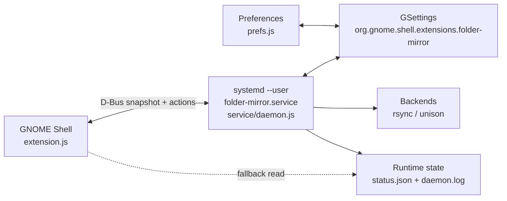
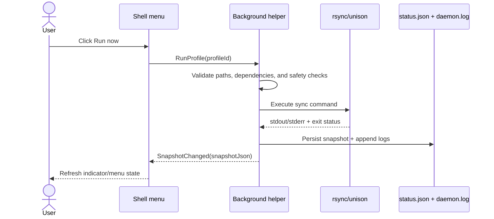

# Folder Mirror

`Folder Mirror` is a GNOME Shell extension for managing local mirror and sync
profiles from the top bar.

It is aimed at development workflows where you want a container-, VM-, or
sandbox-facing mirror of an existing repository without changing the original
working copy.

This extension is stored in this repository at [`extensions/folder-mirror/`](.).

- Source: [github.com/mauragas/gnome-shell-extensions](https://github.com/mauragas/gnome-shell-extensions)
- Issue tracker: [github.com/mauragas/gnome-shell-extensions/issues](https://github.com/mauragas/gnome-shell-extensions/issues)
- License: [`../../LICENSE`](../../LICENSE)

## Features

- Top-bar panel indicator for mirror status
- GTK4/Libadwaita preferences window for profile editing
- Background helper service launched by `systemd --user`
- One-way mirrors powered by `rsync`
- Two-way sync profiles powered by `unison`
- Global exclude defaults plus per-profile exclude rules
- Optional per-profile exclusion of files that Git currently ignores via `.gitignore`
- Scheduler-based watch mode with serialized per-profile runs
- Dry-run support for validating a profile before running it for real
- Diagnostics page for helper state, dependencies, and recent errors
- Optional manifest importer for example/bootstrap profile sets

## Architecture



## Runtime flow



## Requirements

- GNOME Shell `46`, `47`, or `48`
- `gjs`
- `git` (required for the **Exclude Git-ignored files** feature)
- `glib-compile-schemas`
- `systemctl --user`
- `rsync`
- `unison`

## Install

Run the installer from this directory:

```bash
./install.sh
```

The install script:

1. Creates a symlink from `~/.local/share/gnome-shell/extensions/folder-mirror`
   to this source directory
2. Compiles the local GSettings schema
3. Generates `~/.config/systemd/user/folder-mirror.service`
4. Reloads `systemd --user`, enables the helper service, and restarts it
5. Attempts to enable the GNOME Shell extension immediately, or queues it for
   the next login if GNOME Shell has not discovered the UUID yet
6. Prints warnings when optional runtime dependencies such as `rsync` or
   `unison` are missing

After installing, restart GNOME Shell if the extension is not visible yet:

- Wayland: log out and back in
- X11: press `Alt+F2`, type `r`, then press `Enter`

## Usage

1. Open `Folder Mirror` from the top bar.
2. Use **Open Preferences** to create and edit profiles.
3. Configure a source path, target path, mode, and exclude rules.
   If the project is Git-based, leave **Exclude Git-ignored files** enabled to
   automatically exclude files that Git currently ignores via `.gitignore`.
4. Use **Run now** or **Run all now** to trigger an immediate sync.
5. For automatic syncing, keep the profile enabled with **Watch mode** turned on.

The helper stores runtime diagnostics under:

- `~/.local/state/folder-mirror/status.json`
- `~/.local/state/folder-mirror/logs/daemon.log`
- `~/.cache/folder-mirror/`

## Default ignore behavior

The built-in development exclude set is intentionally conservative and includes
common generated or temporary state such as:

- `.git`, `.svn`, `.hg`
- `.vs`, `bin`, `obj`
- `node_modules`, `dist`, `build`, `out`
- `.next`, `.nuxt`, `.parcel-cache`, `.turbo`, `.angular/cache`
- `coverage`, `TestResults`, `.pytest_cache`, `__pycache__`
- `.cache`, `.eslintcache`, `tmp`, `temp`
- `*.tmp`, `*.swp`, `*.swo`, `*.bak`

It deliberately does **not** exclude `.vscode`, `.devcontainer`, lockfiles, or
general repository config by default.

## Git-ignore-aware exclusion

Each profile includes an **Exclude Git-ignored files** toggle.

When enabled, the helper asks Git which paths are currently ignored by the
project's `.gitignore` rules and excludes those paths from sync in addition to
the normal explicit exclude rules.

This is especially useful for generated or machine-local content that is already
ignored by the repository, such as:

- `node_modules`
- build outputs under `dist`, `out`, or `bin`
- IDE or tool caches
- ignored temp files created during development

For **Two-way** mirrors, the helper evaluates ignored paths from the Git-tracked
source tree and applies the resulting exclusions to both replicas. This keeps a
mirror without `.git` metadata from trying to sync back files that the source
repository already treats as ignored.

## Optional profile-manifest bootstrap

The extension stays general-purpose, but it also ships a small importer utility
for optional example/bootstrap manifests.

### Import a manifest

```bash
gjs -m ./scripts/import-profile-manifest.js --replace ./examples/example-profile-manifest.json
```

The importer loads the local extension schema directly from this source tree, so
it works even though the schema is not installed globally.

### Included validation manifest

The repo includes:

- [`examples/example-profile-manifest.json`](examples/example-profile-manifest.json)

It configures these **Two-way** profiles with a development-focused ignore set:

1. `/path/to/source/project-alpha` → `/path/to/mirrors/container/project-alpha`
2. `/path/to/source/project-beta` → `/path/to/mirrors/vm/project-beta`
3. `/path/to/source/project-gamma` → `/path/to/mirrors/vm/project-gamma`

These are example/bootstrap profiles only. They are not auto-seeded by the
extension. The included profiles also enable **Exclude Git-ignored files**.

## Live validation ideas

Good manual validation steps after install:

1. Import or create the three example profiles above.
2. Open the preferences window and confirm the profile editor loads the selected
   values cleanly.
3. Use **Dry run** on each profile before the first live sync.
4. Open the top-bar menu and verify helper state, per-profile rows, and actions.
5. Make a small file change on one side and confirm the helper updates the live
   snapshot after a manual run or watch interval.

For **Two-way** profiles, `Folder Mirror` prefers a true Unison dry run when the
installed Unison build supports `-dryrun`. When it does not, the extension falls
back to a safe **preflight preview** that validates paths and shows the generated
Unison configuration without writing changes.

## Testing

Run the pure logic tests from this directory:

```bash
npm test
```

Verify the installer script syntax:

```bash
bash -n ./install.sh
```

If `glib-compile-schemas` is available, verify the schema file too:

```bash
glib-compile-schemas --strict --dry-run ./schemas
```

## Troubleshooting

### The helper shows as stopped

- Check the unit status: `systemctl --user status folder-mirror.service`
- Check the helper log: `journalctl --user -u folder-mirror.service`
- Open the diagnostics page and refresh the helper state

### One-way sync works but two-way sync does not

- Verify that `unison` is installed and on `PATH`
- Check the diagnostics page for the dependency list
- Inspect `~/.local/state/folder-mirror/logs/daemon.log`

### The extension is installed but the indicator does not appear

- Re-run `./install.sh`
- Restart GNOME Shell
- Confirm that `show-indicator` is enabled in the preferences window
- On some Wayland/Zorin sessions, `gnome-extensions info folder-mirror` may show
   `Enabled: Yes` but `State: INACTIVE` until you fully log out and log back in.
   A full session restart is the reliable way to force GNOME Shell to reload a
   newly added or heavily edited local extension.

### Dry run fails immediately

- Ensure the selected profile has distinct source and target directories
- Ensure the source path exists
- For one-way mirrors, create the destination path or let the helper create it
  on the next run if permissions allow it
- For two-way syncs, remember that some Unison builds do not implement
   `-dryrun`; in that case the preferences window returns a safe preflight
   preview instead of executing a write-capable sync command

### The preferences folder picker does not open on an older GTK stack

The preferences window first tries `Gtk.FileDialog` and falls back to
`Gtk.FileChooserNative` when needed. If neither works cleanly in your session,
type the folder path manually into the source/target entry rows.

`schemas/gschemas.compiled` is generated locally by `./install.sh` and is
intentionally not committed.
